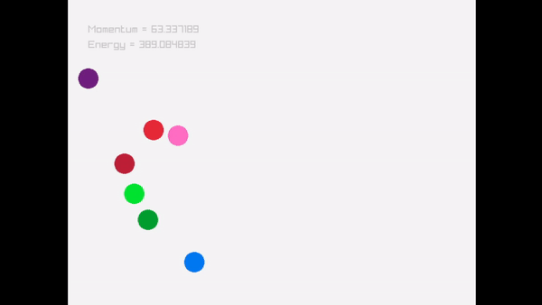

# Bounce

This is a simple program which calculates collisions, and displays graphically how particles interact.

It suports long-range particle interactions such as gravity, springs, etc.
## Quick Start
Dependencies:
* [Raylib](https://github.com/raysan5/raylib/)

You can compile the code and run it only typing the command:
```
make
```
It is possible to pause the simulation pressing space.

## Output:
  
Particles bouncing and being atracted gravitacionally between each other.
